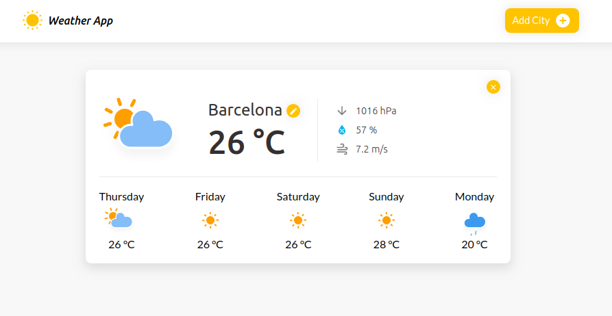
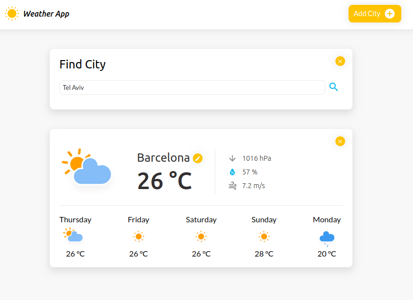
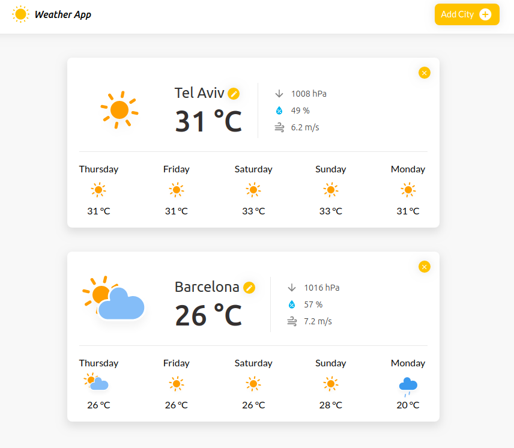

# Weather App

## About

Simple weather app created with JavaScript and Node.js using open source APIs.
- Automatically displays current weather conditions and weather forecast for the next 5 days using the OpenWeatherMap API.

- Provides a city browser to get weather conditions from different places in the world.

### Weather Details
Based on Geolocation, the app provides the following data:

- General Weather Conditions
- Temperature
- Humidity
- Pressure
- Wind Speed

### APIs

- IPLocating API
- OpenWeatherMap API
- GraphHopper API

### Mode of use

* Download the project and use `npm i` command to install all the modules listed as dependencies in `package.json`.

* Get your own API keys to make use of [GraphHopper Directions API with Route Optimization](https://graphhopper.com) and
[OpenWeatherMap API](https://openweathermap.org/appid). Paste your API keys to the `.env_sample` file and rename the file to `.env`.

* Use the command `npm start`. The app will start running at http://localhost:3001.
